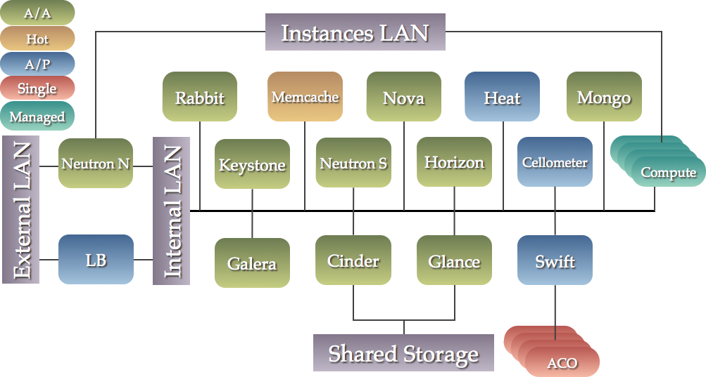

()[]https://docs.openstack.org/ha-guide/
### OpenStack高可用介绍
高可用系统力求将以下问题最小化
1. 系统停机时间：用户所使用的服务器在一段时间内无法使用
2. 数据丢失：数据被意外删除或销毁
大多数高可用系统在单个故障生时可以提供保护，即防止关机或数据丢失。然后进行故障联防是十分必要的，即防止单个故障恶化为更严重的后续故障。许多服务提供Service Level Agreement (SLA)，其中包括计算服务的正常运行时间百分比，该百分比是根据可用时间和系统停机时间(不包括计划停机时间)计算的。

正常运行时间=可用时间/停机时间

####冗余和故障转移（Redundancy and failover）
高可用性是通过运行每个服务的冗余实例的冗余硬件实现的。
如果运行一个服务实例的硬件部分发生故障，系统就可以进行故障转移，以使用运行在没有发生故障的硬件上的另一个服务实例。高可用性的一个关键方面是消除单点故障(SPOFs)。
SPOF是一种单独的设备或软件，如果出现故障，会导致系统停机或数据丢失。为了消除SPOFs，检查是否存在冗余机制:
* 网络组件，如交换机和路由器
* 应用程序和自动服务迁移
* 存储组件
* 电力、空调、消防等服务设施
如果组件发生故障，备份系统必须承担其负载，大多数高可用性系统将尽快替换失败的组件，以保持必要的冗余。这样，在降级保护状态下所花费的时间就会最小化。
大多数高可用性系统在出现多个独立故障时而引发整体性故障的情况下，**倾向于保护数据而不是维护可用性。**
高可用性系统通常可实现 *99.99％* 或更高的正常运行时间百分比，这大致相当于 *每年不到一小时* 的累计停机时间。 为了实现这一目标，高可用性系统应该在故障发生后将恢复时间保持在大约 *一到两分钟*，有时甚至更少。OpenStack目前满足其自身基础架构服务的可用性要求，这意味着OpenStack基础架构正常运行99.99％的正常运行时间。 但是，OpenStack不保证单个访问实例的99.99％可用性。
本文档讨论了实现高可用性系统的一些常用方法，重点是核心OpenStack服务以及与OpenStack紧密结合的其他开源服务。

您需要解决在OpenStack环境中运行的任何应用程序软件的高可用性问题，重要的是确保您的服务冗余且可用。

#### 无状态和有状态服务(Stateless versus stateful services)

以下是无状态和有状态服务的定义:

* 无状态服务（Stateless）

在您的请求之后提供响应的服务，然后不需要进一步关注。要使无状态的服务高度可用，需要提供冗余实例并平衡它们的负载。无状态的OpenStack服务包括nova-api、nova-conductor、gls -api、keystone-api、neutron-api和nova-scheduler。

有状态服务(stateful)

服务的后续请求依赖于第一个请求的结果。有状态服务更难管理，因为单个操作通常涉及多个请求。提供额外的实例和负载平衡并不能解决问题。例如，horizon用户界面每次进入新页面时都自动重置。有状态的OpenStack服务包括OpenStack数据库和消息队列。使有状态服务高可用性取决于您选择的是Active/passive配置还是active/active配置。

#### Active/passive versus active/active

有状态服务(stateful)可以配置为 active/passive 或 ctive/active，其定义如下:

* active/passive configuration

**维护可在活动服务失败时联机的冗余实例**。 例如，OpenStack在维护灾难恢复数据库的同时写入主数据库，如果主数据库发生故障，该数据库可以联机。有状态服务的典型 active/passive 安装和维护可在需要时联机的替换资源。 使用虚拟IP地址（VIP）处理请求，这有助于以最小的重新配置返回服务。 单独的应用程序（如Pacemaker或Corosync）会监视这些服务，并在必要时将备份联机。

* active/active configuration

**每个服务均具有一份，其同时管理主系统和冗余系统**。发生故障時，用户可能並不会觉察。 在主系统修复之前,备份系统已经在线运行,并承担所提高的负载。
通常，无状态服务的 active/active 安装维护冗余实例，并使用虚拟IP地址和负载平衡器（如HAProxy）对请求进行负载平衡。

有状态服务的典型 主动/主动 安装包括冗余服务，所有实例具有相同的状态。
换句话说，对数据库的一个实例的更新会更新所有其他实例。
这样，对一个实例的请求与对任何其他实例的请求相同。 负载均衡器管理这些系统的流量，确保操作系统始终处理请求。

#### 集群及数量 Clusters and quorums

quorum指定冗余节点集群中必须具有功能的节点的最小数量，以便集群保持功能。当一个节点发生故障，故障转移将控制转移到其他节点时，系统必须确保数据和进程保持正常。为了确定这一点，将比较剩余节点的内容，如果存在差异，则执行一个多数规则算法。因此，高可用性环境中的每个集群都应该有奇数个节点，并且quorum定义为超过一半的节点。如果多个节点失败，以致集群大小低于仲裁值，那么集群本身就会失败。
例如，在一个7节点集群中，应该将quorum设置为floor(7/2) + 1 == 4。如果quorum是4，同时有4个节点失败，那么集群本身就会失败，而如果不超过3个节点失败，它将继续运行。如果分别划分为3个和4个节点的分区，那么4个节点的quorum将继续操作多数分区，并停止或隔离少数分区(取决于无quorum-policy集群配置)。

当四个节点同时失败时，集群也将继续工作。但是，如果分别划分为3个节点和4个节点，那么3个节点的quorum将使双方都试图隔离其他节点和主机资源。如果不启用隔离，将直接运行每个资源的两个副本。
这就是为什么将quorum设置为小于floor(n/2) + 1是危险的。但是，对于某些特定的情况，可能需要这样做，例如在一个节点上，我们100%确定其他节点已经关闭了。在作为研究或演示而配置OpenStack环境时，可以关闭quorum检查。生产环境下应该在启用quorum的情况下运行。

#### Single-controller高可用性模式

OpenStack支持由管理高可用性环境的服务管理的单控制器高可用性模式，但实际上不是高可用性模式，因为没有配置冗余控制器用于故障转移。此环境可用于研究和演示，但不适用于生产环境。可以向这样的环境添加控制器，将其转换为真正高可用的环境。高可用性并不是对每个用户都适用。它带来了一些挑战。对于具有大量数据的数据库或系统来说，高可用性可能过于复杂。复制会减慢大型系统的速度。不同的设置有不同的先决条件。

### 高可用性的硬件配置

OpenStack不需要大量的资源,具有核心服务和几个实例的高可用性环境应以下最低要求应支持

| Node type          | 核心数 |  内存 | 硬盘 | NIC|
| --------           | :---: |  :--:| :---:|:--:|
| controller node    | 4     | 12G  |120G  |2   |
| compute node       | 8+    | 12+G |120+G |2   |

我们建议任何两个控制器节点之间的最大延迟为2毫秒。虽然集群软件可以调优到更高的延迟，但一些供应商在同意支持安装之前坚持这个值。您可以使用ping命令查找两个服务器之间的延迟。
### 虚拟硬件设置

为了演示和学习，您可以在虚拟机(VMs)上设置测试环境。这有以下好处:
一个物理服务器可以支持多个节点，每个节点几乎支持任意数量的网络接口。您可以在整个安装过程中定期进行快照，并在出现问题时回滚到工作配置。但是，在vm上运行OpenStack环境会降低实例的性能，特别是当您的管理程序或处理器不支持嵌套vm的硬件加速时。

### 配置NTP

您必须配置NTP来正确地同步节点间的服务。我们建议您配置controller节点来引用更精确(底层)的服务器，并配置其他节点来引用controller节点。有关更多信息，请参阅安装指南。

### 安装Memcached

大多数OpenStack服务可以使用Memcached存储短暂的数据，比如令牌。尽管Memcached不支持典型形式的冗余(比如集群)，但OpenStack服务可以通过配置多个主机名或IP地址来使用几乎任意数量的实例。Memcached客户端实现了hash以平衡实例之间的对象。实例的失败只会影响某个对象的百分比，客户端会自动将其从实例列表中删除。内存缓存由osl.cache管理。

这确保了使用多个Memcached服务器时所有项目之间的一致性。下面是一个包含三个主机的配置示例:
Memcached_servers = controller1:11211 controller2:11211 controller3:11211
默认情况下，controller1处理缓存服务。如果主机宕机，controller2或controller3将完成服务。

### 配置共享服务
#### 高可用数据库

第一步是安装位于集群中心的数据库。要实现高可用性，请在每个控制器节点上运行数据库实例，并使用Galera集群在它们之间提供复制。Galera集群是基于MySQL和InnoDB存储引擎的同步多主数据库集群。它是一个高可用性服务，提供了高系统正常运行时间、无数据丢失和可伸缩性的增长。
根据您想要使用的数据库类型，可以通过许多不同的方式实现OpenStack数据库的高可用性。Galera集群有三种实现:
* Galera Cluster for MySQL
* MariaDB Galera Cluster: Galera集群的MariaDB实现，该集群通常在基于Red Hat发行版的环境中得到支持。
* Percona XtraDB Cluster
#### 高可用消息队列

为了协调进入系统的作业的执行，大多数OpenStack组件都需要一个符合AMQP(高级消息队列协议)的消息总线。
OpenStack安装中最流行的AMQP实现是RabbitMQ。
RabbitMQ节点在应用程序层和基础结构层上失败。应用层由多个AMQP主机的oslo配置选项控制。如果AMQP节点失败，应用程序将重新连接到指定的重新连接间隔内配置的下一个节点。
如果AMQP节点失败，应用程序将重新连接到指定的重新连接间隔内配置的下一个节点。

指定的重新连接间隔构成其SLA。
在基础架构层，SLA是RabbitMQ集群重新组装的时间。Mnesia管理器节点管理RabbitMQ相应资源。当它失败时，即为一个完整的AMQP集群停机时间间隔。通常，它的SLA不超过几分钟。
如果另一个节点是RabbitMQ的相应Pacemaker资源的从属节点，则完全不会导致AMQP集群停机。
使RabbitMQ服务高可用涉及以下步骤：
1. 安装RabbitMQ
2. 配置RabbitMQ为高可用队列
3. 配置OpenStack服务使用RabbitMQ高可用队列
##### 安装RabbitMQ

##### 配置RabbitMQ为高可用队列

以下服务或组件可以使用高可用队列
* OpenStack Compute
* OpenStack Block Storage
* OpenStack Networking
* Telemetry
考虑一下，虽然交换器和绑定可以在单个节点丢失的情况下存活下来，但是队列和它们的消息不会因为队列及其内容位于一个节点上而消失。如果丢失这个节点，也会丢失队列。RabbitMQ中的镜像队列提高了服务的可用性，因为它对故障具有弹性。生产服务器应该运行(至少)三个RabbitMQ服务器，以进行测试和演示，但是只能运行两个服务器。在本节中，我们配置了两个节点，称为rabbit1和rabbit2。确保所有节点都具有相同的Erlang cookie文件。

##### 配置OpenStack服务使用RabbitMQ高可用队列
配置Openstack组件，以确保其至少使用两个RabbitMQ节点

### 控制节点的配置
OpenStack是一组作为HTTP(s) api公开给最终用户的服务。此外，对于您自己的内部使用，OpenStack需要一个SQL数据库服务器和AMQP代理。所有组件运行的物理服务器称为控制器。这个模块化的OpenStack体系结构允许您复制所有组件并在不同的控制器上运行它们。通过使所有组件冗余，可以使OpenStack高可用性成为可能。
一般来说，我们可以将所有OpenStack组件分为三类:

1. OpenStack api:使用python编写的HTTP(s)无状态服务的api，易于复制，并且很容易实现负载平衡。
2. SQL关系数据库服务器提供其他组件使用的有状态类型。支持的数据库有MySQL、MariaDB和PostgreSQL。使SQL数据库冗余是很复杂的。
3. 高级消息队列协议(AMQP)提供了OpenStack内部有状态通信服务。

### 常见的部署架构
我们推荐两种使OpenStack高可用的主要体系结构。在集群管理的服务集合中，体系结构各不相同。两者都使用集群管理器(如Pacemaker或Veritas)来协调跨一组机器的各种服务的操作。因为我们关注的是FOSS，所以我们将其称为“Pacemaker architectures”。
传统上，Pacemaker architectures被定位为一个完整的解决方案。但是，随着OpenStack服务的成熟，它们越来越能够在活动/活动配置中运行，并且能够优雅地应对其所依赖的api的消失。
考虑到这一点，一些供应商将起搏器的使用限制在必须以主动/被动模式操作的服务（cinder-volume）、具有多个状态的服务(for example, Galera),和具有复杂引导过程的服务(such as RabbitMQ)。
大多数服务，不需要真正的编排，都是由每个节点上的系统来处理的。这种方法避免了与集群协调服务升级或位置更改的需要，并且具有更容易伸缩的额外优势。然而，它通常需要添加一个企业监控解决方案，例如Nagios或Sensu，用于那些希望进行集中故障报告的人。

#### Pacemaker 架构
##### 什么是集群管理器（cluster manager）?

集群的核心是分布式有限状态机，能够跨一组机器协调相关服务的启动和恢复。即使是能够在一台或多台机器上经受失败考验的分布式或复制应用程序，也可以从集群管理器获益，因为集群管理器具有以下功能:

1. 知晓在堆栈中的应用程序
2. 知晓机器中的实例
3. 一个共享的实现和quorum的计算
4. 通过隔离实现数据完整性(无响应的流程并不意味着它什么都不做)
5. 自动恢复失败的实例

##### 部署风格
可以部署三种不同风格的起搏器体系结构。无论您选择哪种类型，我们建议集群至少包含三个节点，以便您可以利用Quorum。当故障导致集群分裂为两个或多个分区时，Quorum就变得非常重要。在这种情况下，您希望系统中的大多数成员确保少数成员真正死亡并继续托管资源。对于两个节点的集群，没有哪一方占多数，您可能会遇到这样的情况:双方相互隔离，或者双方都运行相同的服务。这可能导致数据损坏。拥有偶数个宿主的集群也面临着类似的问题。单个网络故障很容易导致N:N分裂，其中任何一方都不保留多数。因此，我们建议在进行扩展时使用奇数个集群成员。最多可以有16个集群成员(目前受corosync扩展到更高级别的能力限制)。在极端情况下，32个甚至64个节点都是可能的。然而，这并没有得到很好的测试。

##### Collapsed（折叠）
在Collapsed配置中，有一个由3个或更多节点组成的集群，每个组件都在此集群上运行。这个场景的优点是需要更少(如果更强大)的机器。此外，作为单个集群的一部分，可以精确地建模组件之间的排序依赖关系。这个场景如下所示。

如果您喜欢拥有更少但更强大的box，则您可以选择此选项。
这是最常见的选项，也是我们在这里记录的。

##### Segregated (隔离)

在此配置中，每个服务在一个由3个或更多节点组成的专用集群中运行。
这种方法的好处是组件之间的物理隔离以及为特定组件增加容量的能力。
如果您想拥有更多但功能更少的box，那么您可以选择这个选项。
这个场景可以如下图所示，下面的每个框表示一个由三个或更多来宾组成的集群。

##### Mixed (混合)
对于一个或多个可能成为瓶颈的组件，也可以采用隔离方法，其余的组件使用折叠方法。

##### 代理服务器（Proxy server）
这个堆栈中的几乎所有服务都可以通过代理获益。使用代理服务器可以提供以下功能

1. 载荷分布

许多服务可以以活动/活动的方式工作，但是，它们通常需要一个外部机制来将请求分发到可用的实例上。代理服务器可以承担这项任务

2. API隔离

通过通过代理发送所有API访问，您可以清楚地识别服务之间的依赖关系。如果需要，您还可以将它们移动到本地主机以外的位置以增加容量。

3. 添加/删除节点的简化过程

由于所有API访问都指向代理，因此添加或删除节点对其他服务的配置没有影响。这在升级场景中非常有用，在此场景中，可以在隔离配置和测试一组全新的机器，然后告诉代理将实例进行迁移。

4. 提高故障检测
可以将代理配置为检测服务故障的二级机制。它甚至可以配置为查找处于降级状态的节点(例如在复制中太落后)，并将它们从循环中移除。

以下组件目前无法从代理服务器的使用中获益
* RabbitMQ
* Memcached
* MongoDB

通常，我们使用循环在活动/活动服务的实例之间分配负载。另外，Galera使用粘贴表选项来确保进入虚拟IP (VIP)的连接只指向一个可用的后端。这有助于避免锁争用和防止死锁，尽管Galera可以运行active/active。与httpchk选项结合使用，这确保只允许与对等节点同步的节点处理请求。

#### Pacemaker cluster stack

Pacemaker集群堆栈是Linux平台上最先进的高可用性和负载平衡堆栈。Pacemaker用于使OpenStack基础设施高度可用。Pacemaker依赖Corosync消息传递层进行可靠的集群通信。Corosync实现Totem单环排序和成员协议。它还向Pacemaker提供基于UDP和InfiniBand的消息传递、quorum和集群成员身份。Pacemaker本身并不理解它管理的应用程序。相反，它依赖于资源代理(resource agents, RAs)，这些脚本封装了如何启动、停止和检查集群管理的每个应用程序的健康状况的知识。这些代理必须符合OCF、SysV Init、Upstart或Systemd标准之一。Pacemaker附带了大量的OCF代理(例如管理MySQL数据库、虚拟IP地址和RabbitMQ的代理)，但也可以使用系统上已经安装的任何代理，并且可以使用自己的代理进行扩展(请参阅开发指南)。
##### 安装包
在任何打算成为Pacemaker集群一部分的主机上，通过Corosync消息传递层建立集群通信。这涉及到安装以下包(以及包管理器通常自动安装的依赖包):

pacemaker
pcs (CentOS or RHEL) or crmsh
corosync
fence-agents (CentOS or RHEL) or cluster-glue
resource-agents
libqb0

#### HAProxy
HAProxy为TCP或HTTP应用程序提供了一个快速可靠的HTTP反向代理和负载平衡器。它特别适用于在非常高的负载下web爬行，同时需要持久化或第7层处理。它实际上支持与最新硬件的数万个连接。HAProxy的每个实例都将其前端配置为只接受虚拟IP (VIP)地址的连接。HAProxy后端(终止点)是用于负载平衡的实例的所有IP地址的列表。
#### Memcached
Memcached是一种通用的分布式内存缓存系统。它通过缓存RAM中的数据和对象来加速动态数据库驱动的网站，以减少必须读取外部数据源的次数。Memcached是一个内存缓存，大多数OpenStack服务都可以使用它来存储短暂的数据。
HAProxy不处理对Memcached的访问，因为复制访问目前处于实验状态。相反，OpenStack服务必须提供运行Memcached的主机的完整列表。
Memcached客户端实现了散列以平衡实例之间的对象。实例的失败只会影响一部分对象，客户端会自动将其从实例列表中删除。SLA是几分钟。

### 配置计算节点
安装指南提供了安装多个计算节点的说明。要使计算节点高度可用，您必须配置环境，使其包含API和其他服务的多个实例。
#### 为实例配置高可用性
截至2016年9月，OpenStack高可用社区正在设计和开发一种官方的、统一的方式来为实例提供高可用性。我们正在开发从计算节点上的硬件或与管理程序相关的软件故障中自动恢复，或其他可能阻止实例正常运行的故障，例如煤渣卷I/O路径问题。

更多的细节可以在OpenStack的HA社区和产品工作组(PWG)共同编写的用户故事中找到，其中这个特性被认为是OpenStack中缺失的功能，应该以高度优先的方式处理。
